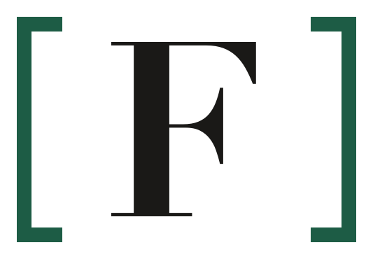
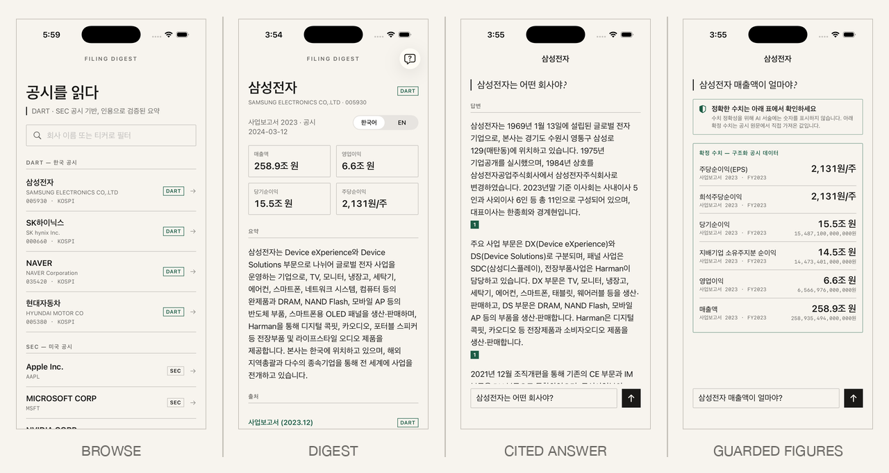
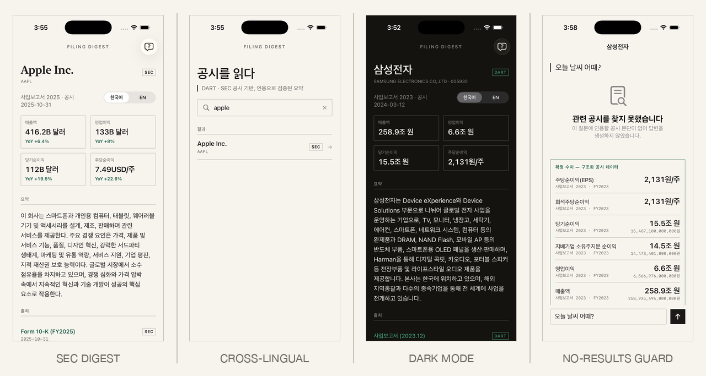
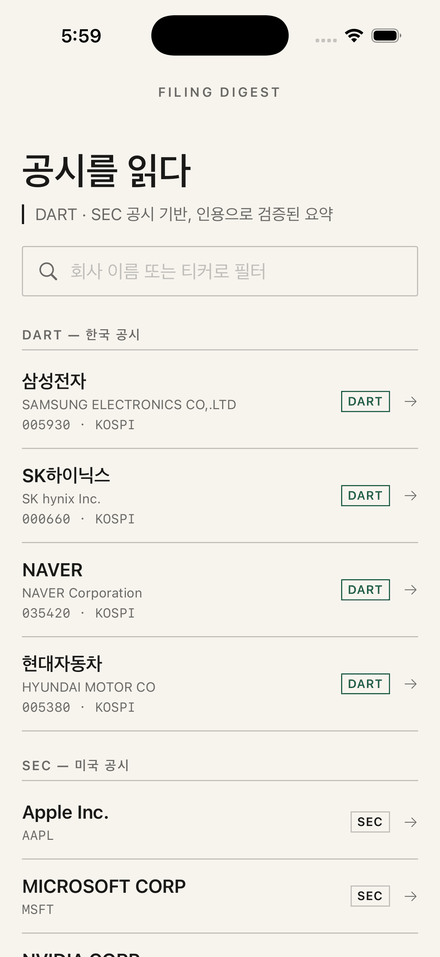
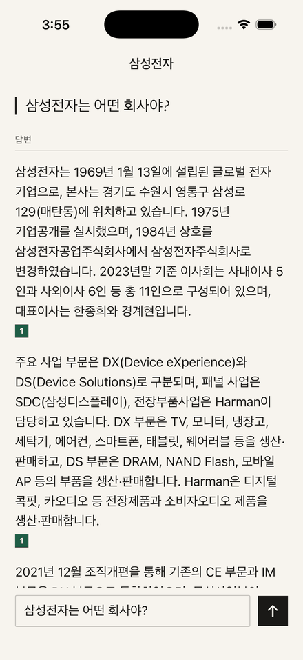

<div align="center">

<picture>
  <source media="(prefers-color-scheme: dark)" srcset="docs/design/logos/mark_dark.png">
  
</picture>

# Filing Digest

**Every claim carries a citation.**

A bilingual iOS reader for Korean DART and US SEC filings, backed by a
citation-grounded FastAPI retrieval pipeline.

[](https://github.com/mhju0/filing-digest/actions/workflows/ci.yml)
[](LICENSE)


</div>

> **Status:** v0.2.0, feature-complete portfolio project in maintenance mode.
> There is no hosted public demo; run it locally with your own DART and Upstage
> credentials. No production data or API keys are included.

Filing Digest separates financial figures from generated prose. Structured
DART/SEC endpoints supply every displayed number. KURE-v1 retrieval selects
source passages, Solar writes narrative only, and deterministic guards reject
uncited claims or financial numbers in generated text.

## Product

- Browse and filter Korean and US public companies.
- Read bilingual company digests with filing-linked metric cards and YoY changes.
- Ask cross-lingual questions and inspect citations to the original filing.
- Preserve exact financial values on the authoritative figures track even when
  the narrative is blocked or no relevant passage is found.
- Ingest the latest DART annual report or SEC 10-K from one CLI command.

<div align="center">





 &nbsp; 

</div>

## Architecture

```text
SwiftUI (iOS 17) -> FastAPI (Python 3.11) -> PostgreSQL 16 + pgvector
                              |-> DART OpenAPI / SEC EDGAR
                              |-> KURE-v1 embeddings
                              `-> Upstage Solar narrative generation
```

The ingestion path parses filing prose, removes tables, chunks text, embeds it
with normalized 1024-dimensional KURE-v1 vectors, and writes an HNSW-indexed
pgvector corpus. DART and SEC structured facts are stored separately in
`financials` as `numeric(24,4)` values.

The answer path has two independent tracks:

1. `financials` rows become exact, citation-bearing figures without passing
   through an LLM.
2. Retrieved filing chunks are sent to Solar under positional labels. The
   response is schema-validated, labels are mapped back to real chunk IDs, and
   citation and number guards run before any prose reaches the client.

See [docs/ARCHITECTURE.md](docs/ARCHITECTURE.md) for component boundaries,
schema decisions, and the API contract. The implemented visual system is in
[docs/design/DESIGN.md](docs/design/DESIGN.md).

## Stack

- **Backend:** FastAPI, Pydantic v2, SQLAlchemy 2.x, psycopg 3, httpx
- **Storage:** PostgreSQL 16, pgvector, HNSW cosine index
- **Retrieval:** `nlpai-lab/KURE-v1`, 1024-dimensional normalized embeddings
- **Generation:** Upstage Solar through an OpenAI-compatible HTTP adapter
- **iOS:** SwiftUI, URLSession, Codable, Swift Testing; no third-party packages
- **Quality:** pytest, Ruff, GitHub Actions

## Local setup

Prerequisites: Python 3.11, Docker with Compose, and Xcode 16 or newer for the
iOS client.

```bash
python3.11 -m venv .venv
.venv/bin/pip install -r backend/requirements.txt
.venv/bin/pip install ruff==0.15.21
cp backend/.env.example backend/.env
docker compose up -d db
cd backend
../.venv/bin/python -m uvicorn app.main:app --reload --port 8001
```

Fill in `backend/.env` before using DART, SEC ingestion, or generated narrative.
The file is ignored by Git. The embedding model is downloaded from Hugging Face
on first use; set `EMBEDDING_WARMUP_ENABLED=false` when you only need lightweight
API or health checks.

| Variable | Required | Purpose |
|---|---:|---|
| `DART_API_KEY` | DART ingestion | OpenDART credential |
| `DART_BASE_URL` | No | Defaults to `https://opendart.fss.or.kr/api` |
| `SOLAR_API_KEY` | Narrative | Upstage credential |
| `SOLAR_BASE_URL` | No | Defaults to `https://api.upstage.ai/v1` |
| `SOLAR_MODEL` | No | Defaults to `solar-pro3` |
| `SEC_BASE_URL` | No | Defaults to `https://data.sec.gov` |
| `SEC_USER_AGENT` | SEC ingestion | Must contain real contact information |
| `DATABASE_URL` | No | Local default targets PostgreSQL on port 5433 |
| `EMBEDDING_MODEL` | No | Defaults to `nlpai-lab/KURE-v1` |
| `EMBEDDING_OFFLINE_FIRST` | No | Prefer a cached model snapshot |
| `EMBEDDING_WARMUP_ENABLED` | No | Load the model during API startup |

The Compose backend is optional and isolated behind the `container` profile. It
reads the same gitignored `backend/.env` as native uvicorn and persists the
Hugging Face model cache in a named volume:

```bash
docker compose --profile container up -d --build backend
```

### Ingest data

From `backend/` with the database running:

```bash
../.venv/bin/python -m app.ingest --source dart --ticker 000660
../.venv/bin/python -m app.ingest --source sec --ticker NVDA
```

The reference portfolio corpus used for the screenshots contains four DART
companies (Samsung Electronics, SK Hynix, NAVER, Hyundai Motor) and four SEC
companies (Apple, Microsoft, NVIDIA, Tesla). That database is local and is not
distributed with the repository; a fresh checkout starts empty.

### Validate

```bash
cd backend
../.venv/bin/ruff check .
../.venv/bin/python -m pytest -q --ignore=tests/test_smoke.py
../.venv/bin/python -m pytest -q  # includes DB-backed smoke tests
docker compose config -q
```

Build the iOS client from the repository root:

```bash
xcodebuild -project ios/FilingDigest.xcodeproj -scheme FilingDigest \
  -destination 'generic/platform=iOS Simulator' build
```

The app targets `http://127.0.0.1:8001` for simulator development.

## API

| Method | Path | Purpose |
|---|---|---|
| `GET` | `/health` | Process liveness and version |
| `GET` | `/companies?q=` | Company browse/filter data |
| `GET` | `/companies/{company_id}/digest?lang=ko\|en` | Metrics, summaries, and filing citations |
| `POST` | `/search` | Bounded semantic search over filing chunks |
| `POST` | `/answer` | Guarded narrative plus authoritative figures |

Ingestion is intentionally CLI-only. The application does not expose a remote
write endpoint.

## Limitations and security scope

- Annual filings only: DART 사업보고서 and SEC 10-K. DART xforms documents and
  attachments are detected but not parsed.
- The similarity threshold is a single calibrated cutoff, not a separate
  semantic-groundedness classifier.
- Generated wording is nondeterministic, so an out-of-corpus numeric question
  may produce `blocked` or `no_results`; figures remain deterministic.
- This is a local, single-user demonstration service. It has no authentication,
  authorization, rate limiting, or multi-tenant isolation and should not be
  exposed directly to the public internet.
- `backend/db/init.sql` initializes an empty database; there is no migration
  history because the archived project does not manage a production database.

## License

[MIT](LICENSE)
