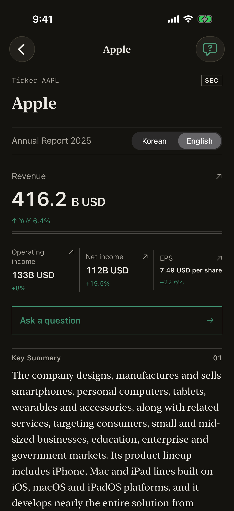

<div align="center">

<picture>
  <source media="(prefers-color-scheme: dark)" srcset="docs/design/logos/mark_dark.png">
  
</picture>

# Filing Digest

Explore key figures from Korean and US company filings, with the original sources.

**[Open the walkthrough](https://mhju0.github.io/filing-digest/)** · [한국어](https://mhju0.github.io/filing-digest/?lang=ko) · [English](https://mhju0.github.io/filing-digest/?lang=en)

[Sister project: Filing Agent](https://github.com/mhju0/filing-agent)

[](https://github.com/mhju0/filing-digest/actions/workflows/ci.yml)


<br>



</div>

Filing Digest is an iPhone app for reading Korean (DART) and US (SEC) annual filings. Key figures and AI explanations sit side by side, and any figure, citation or source row opens the regulator's original document.

The walkthrough is a recorded, read-only tour of the app. It makes no API calls.

**Status:** v0.5.2 · Maintenance · API v0.4 · database schema v0.3

[Maintenance policy and release limits](docs/MAINTENANCE.md)

## How it works

- Figures come from structured DART and SEC data and never pass through the model. Backend code calculates comparisons and ratios.
- KURE-v1 embeddings and pgvector find relevant passages. Gemini Flash-Lite writes the explanation using numbered labels that are mapped back to real passages.
- Guards check the citations and financial expressions in generated text before it reaches the app. If a check fails, the explanation is withheld and the figures still show. The guards do not prove that every sentence is supported by its cited passage.
- Questions that fall below a calibrated similarity threshold (0.42) never reach the model.

## Key facts

| | |
|---|---|
| Stack | FastAPI · PostgreSQL 16 + pgvector · KURE-v1 · Gemini Flash-Lite · SwiftUI (no third-party packages) · Docker Compose |
| Coverage | 18 companies (9 DART, 9 SEC) and 23 annual filings in the owner's [local qualification](docs/COVERAGE.md) of Sept 9, 2026. The database is not distributed; a fresh checkout starts empty |
| Tests | 460 offline tests passed on Oct 2, 2026. CI also runs the PostgreSQL suites and the iOS unit and UI tests |
| Evaluation | A 24-case golden set run against the live API passed 24/24 on Oct 3, 2026 with Gemini Flash-Lite on the 18-company corpus (retrieval Hit@1 0.900, Hit@3 1.000, MRR 0.950). Questions cover only Apple, Microsoft and Samsung Electronics: 14 full-answer and 10 retrieval cases |

## Run locally

Requires Python 3.11, Docker with Compose, Xcode 16 or newer, and your own DART and Gemini keys. No production data or API keys are included.

```bash
python3.11 -m venv .venv
.venv/bin/pip install -r backend/requirements.lock
cp backend/.env.example backend/.env    # add your keys
docker compose up -d db
cd backend && ../.venv/bin/python -m uvicorn app.main:app --reload --port 8001
```

[DEVELOPMENT.md](docs/DEVELOPMENT.md) covers environment variables, ingestion, database upgrades, tests, the API and running on a device.

## Limits

- Annual filings only: supported DART DSD prose and selected SEC 10-K Item 1 and Item 7 sections. This is not whole-document retrieval.
- It is a local, single-user service with no authentication. Do not expose it to the public internet.
- Generated wording varies between runs; figures do not.

## Documentation

| Document | Contents |
|---|---|
| [MAINTENANCE.md](docs/MAINTENANCE.md) | Frozen baseline, permitted fixes and interview operating checks |
| [ARCHITECTURE.md](docs/ARCHITECTURE.md) | Component boundaries, schema decisions, API contract |
| [CONTEXT.md](CONTEXT.md) | Domain glossary: the vocabulary the code is named after |
| [docs/adr/](docs/adr/) | Architecture decisions and the alternatives they replaced |
| [DESIGN.md](docs/design/DESIGN.md) | The implemented visual system and its accessibility floor |
| [RELEASE_READINESS.md](docs/RELEASE_READINESS.md) | Release qualification and remaining limits |

## License

Copyright (c) 2026 Michael Ju. All rights reserved.
No license is granted for use, copying, modification, or distribution of this code as of 2026-07-30. This repository is public for portfolio review purposes only.
